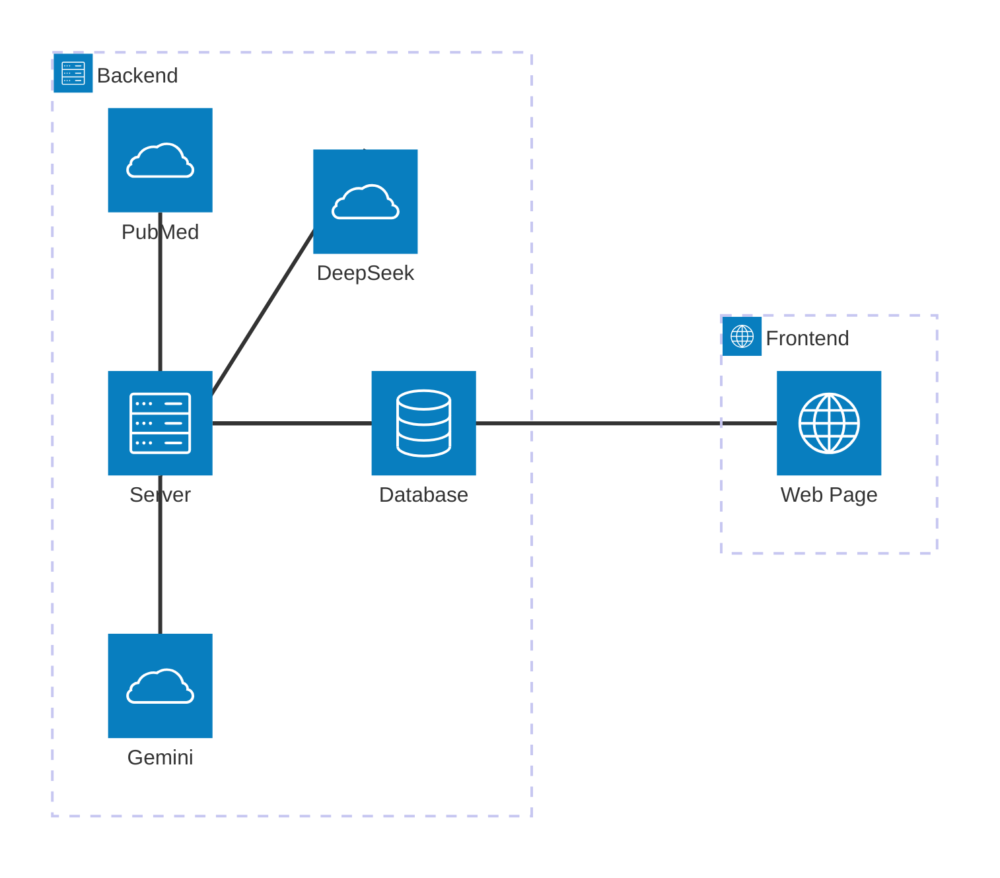

## PubAnalyzer `Simple Architecture Diagram`

```mermaid
architecture-beta

    group frontend(internet)[Frontend]
    service ui(internet)[Web Page] in frontend

    group backend(server)[Backend]
    service server(server)[Server] in backend
    service db(database)[Database] in backend
    service ai1(cloud)[DeepSeek] in backend
    service ai2(cloud)[Gemini] in backend
    service pubMed(cloud)[PubMed] in backend
    

    ui:L -- R:server
    db:L -- R:server
    ai1:T -- B:server
    ai2:T -- B:server
    pubMed:B -- T:server
```
