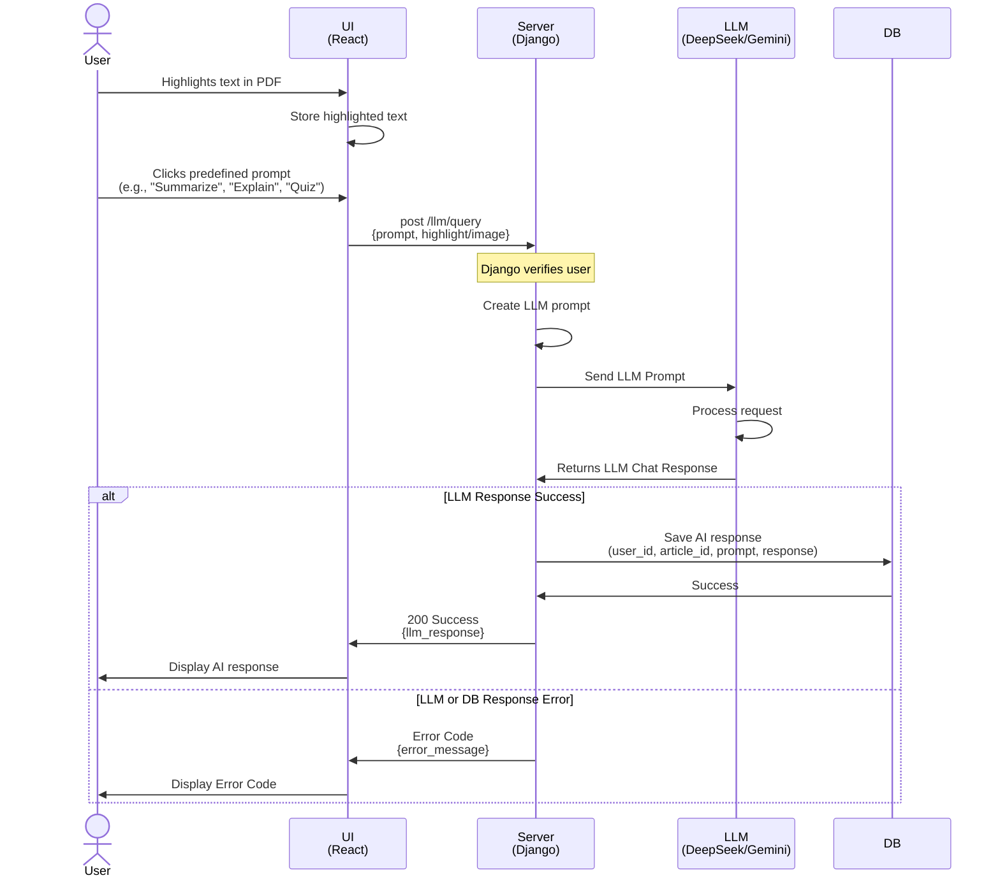

## Generate AI Summaries and Questions - `Sequence`

```mermaid
sequenceDiagram
    actor User
    participant UI as UI<br/>(React)
    participant Server as Server<br/>(Django)
    participant LLM as LLM <br/>(DeepSeek/Gemini)
    participant DB

    User->>UI: Highlights text in PDF
    UI->>UI: Store highlighted text
    User->>UI: Clicks predefined prompt<br/>(e.g., "Summarize", "Explain", "Quiz")
    
    UI->>Server: post /llm/query<br/>{prompt, highlight/image}
    
    Note over Server: Django verifies user
    
    Server->>Server: Create LLM prompt<br/>    
    Server->>LLM: Send LLM Prompt
    LLM->>LLM: Process request
    LLM->>Server: Returns LLM Chat Response

    alt LLM Response Success
        Server->>DB: Save AI response<br/>(user_id, article_id, prompt, response)
        DB->>Server: Success
        Server->>UI: 200 Success<br/>{llm_response}
        UI->>User: Display AI response
    else LLM or DB Response Error
        Server->>UI: Error Code<br/>{error_message}
        UI->>User: Display Error Code
    end    
```
