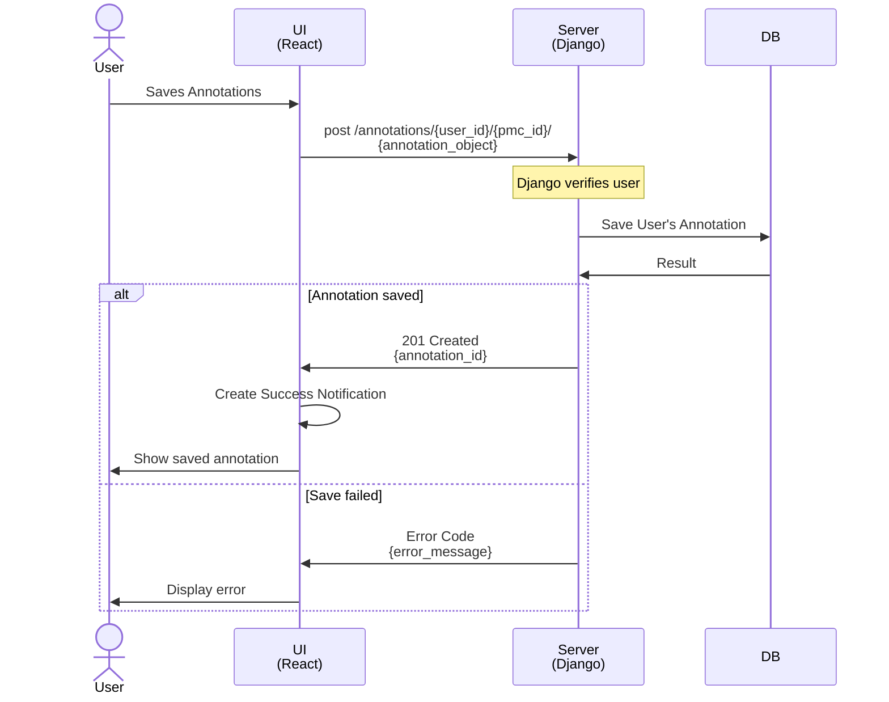

## Annotate and Save PDF - `Sequence`
> This Sequence shows how annotations are retrieved + reapplied to a users previously downloaded PubMed Article.
> Any steps related to retrieving a new document will not be covered.
>
> *See:* [Fetch PubMed Articles](./pdfRetrievalSequence.md) for Sequence to retrieve PDF from PubMed.

