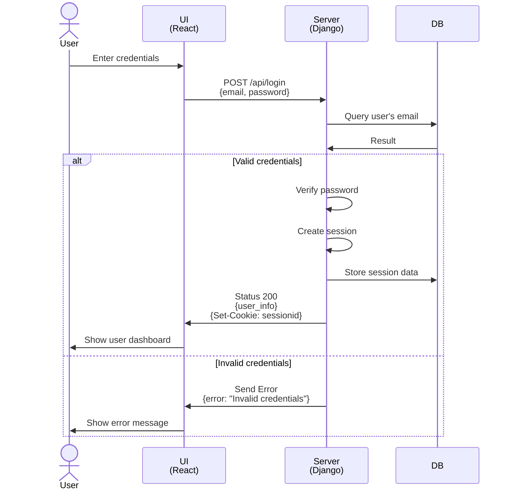

## User Login - `Sequence`

```mermaid
sequenceDiagram
    actor User
    participant UI as UI<br/>(React)
    participant Server as Server<br/>(Django)
    participant DB

    User->>UI: Enter credentials
    UI->>Server: POST /api/login<br/>{email, password}
    Server->>DB: Query user's email
    DB->>Server: Result
    
    alt Valid credentials
        Server->>Server: Verify password
        Server->>Server: Create session
        Server->>DB: Store session data
        Server->>UI: Status 200<br/>{user_info}<br/>{Set-Cookie: sessionid}
        UI->>User: Show user dashboard
    else Invalid credentials
        Server->>UI: Send Error<br/>{error: "Invalid credentials"}
        UI->>User: Show error message
    end
```
