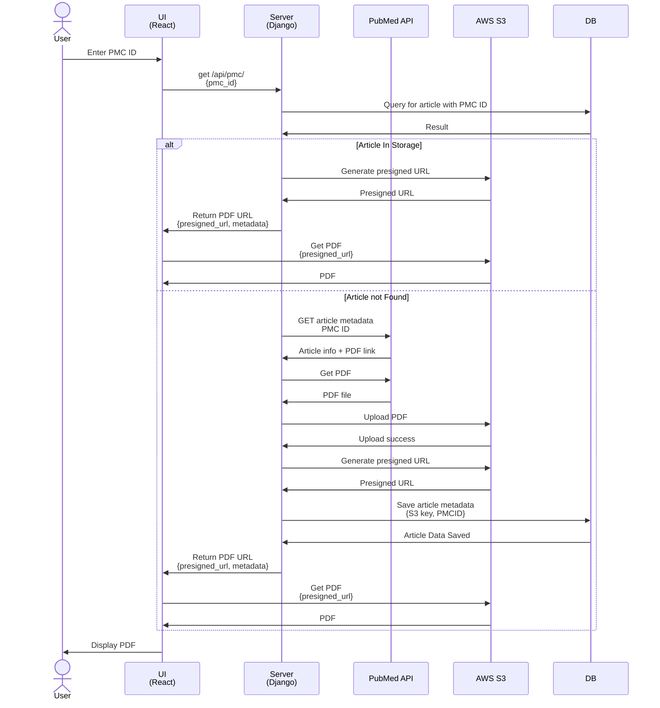

## PubMed PDF Retrieval - `Sequence`

```mermaid
sequenceDiagram
    actor User
    participant UI as UI<br/>(React)
    participant Server as Server<br/>(Django)
    participant PubMed as PubMed API
    participant S3 as AWS S3
    participant DB

    User->>UI: Enter PMC ID
    UI->>Server: get /api/pmc/<br/>{pmc_id}
    Server->>DB: Query for article with PMC ID
    DB->>Server: Result
    
    alt Article In Storage
        Server->>S3: Generate presigned URL
        S3->>Server: Presigned URL
        Server->>UI: Return PDF URL<br/>{presigned_url, metadata}
        UI->>S3: Get PDF<br/>{presigned_url}
        S3->>UI: PDF
    else Article not Found
        Server->>PubMed: GET article metadata<br/>PMC ID
        PubMed->>Server: Article info + PDF link
        Server->>PubMed: Get PDF
        PubMed->>Server: PDF file
        Server->>S3: Upload PDF
        S3->>Server: Upload success
        Server->>S3: Generate presigned URL
        S3->>Server: Presigned URL
        Server->>DB: Save article metadata<br/>{S3 key, PMCID}
        DB->>Server: Article Data Saved
        Server->>UI: Return PDF URL<br/>{presigned_url, metadata}
        UI->>S3: Get PDF<br/>{presigned_url}
        S3->>UI: PDF
    end
    UI->>User: Display PDF
```
