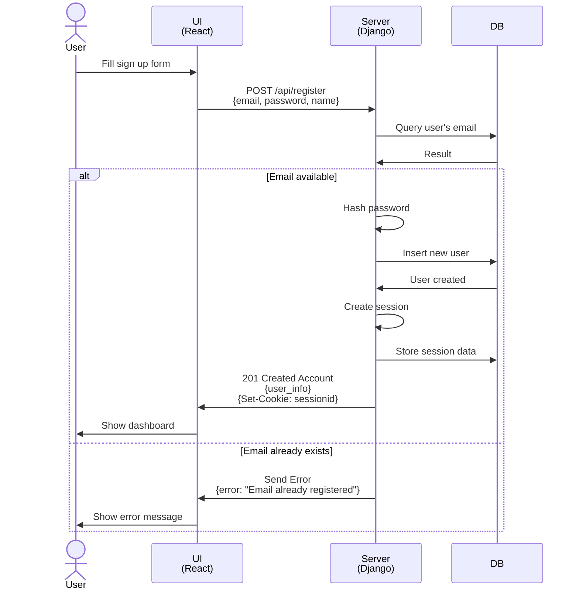

## User Sign Up - `Sequence`

```mermaid
sequenceDiagram
    actor User
    participant UI as UI<br/>(React)
    participant Server as Server<br/>(Django)
    participant DB

    User->>UI: Fill sign up form
    UI->>Server: POST /api/register<br/>{email, password, name}
    Server->>DB: Query user's email
    DB->>Server: Result
    
    alt Email available
        Server->>Server: Hash password
        Server->>DB: Insert new user
        DB->>Server: User created
        Server->>Server: Create session
        Server->>DB: Store session data
        Server->>UI: 201 Created Account<br/>{user_info}<br/>{Set-Cookie: sessionid}
        UI->>User: Show dashboard

    else Email already exists
        Server->>UI: Send Error<br/>{error: "Email already registered"}
        UI->>User: Show error message
    end
```
